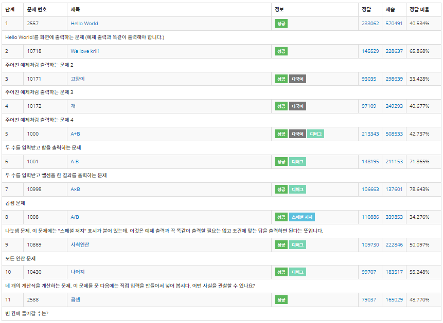

# 📃 Algorithm Study 공부 코드들
```
>> JDk version
: openJdk1.8
```

## ❓ Algorithm Study
개인적 알고리즘 자료구조 공부 용 pkg 입니다.
> 목표 : 꾸준히 하자

## ✔️Pakage 별 정리

## 1. BaekJoon 
- 단계 별로 백준 온라인 문제를 풀어보는 pkg 모음
  > https://www.acmicpc.net/
<details close>
<summary markdown="span"><b> 🕹️ step1 (입출력과 사칙연산)</b></summary>
<div markdown="1">
  
  
  
</div>
</details>

<details close>
<summary markdown="span"><b> 🕹️ step2 (if문) </b></summary>
<div markdown="1">
  


</div>
</details>


<details close>
<summary markdown="span"><b> 🕹️ step3 (for문) </b></summary>
<div markdown="1">



</div>
</details>
